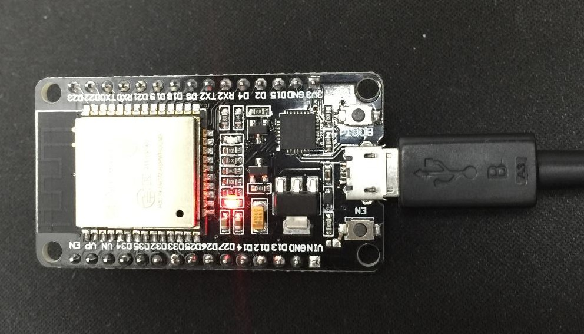

# EM-65C816-ESP32
This project contains the source code for a 65C816 emulator designed for ESP32 based modules and some supporting code to execute within it. Some of its feaures are incomplete (e.g. video, PS/2 support) and the emulator needs mode testing but it boots and runs simple programs so I thought I would make it available for other people to play with.

## Required Hardware & Software
To play with this project you will need an ESP32 module and a USB cable to connect it to a PC. Suitable modules are available on eBay for as little as £4 (direct from China) or a little more on stores like Amazon.

The emulator is written using the ESP32 Arduino framework so you will need a copy of the Arduino IDE (I'm using version 1.8.9) to build it with the ESP32 addins (i.e. Add https://dl.espressif.com/dl/package_esp32_index.json to the board manager list).

After the ESP32 is programmed you might like to use a better terminal emulator to connect to it like TeraTerm (https://osdn.net/projects/ttssh2/releases/. The IDE's terminal window only allows sending lines of text terminated by a line feed ('\n');

## Emulator Details
The emulator supports both the 65C816's emulation and native modes. It supports RESET, IRQ, BRK, COP and NMI interrupts in both modes (although there is no way to generate an NMI at the moment). All interrupts are vectored through their standard vector table locations (defined in the boot ROM).

## Memory
The ESP32 version of this emulator supports a 512K memory map split between RAM and ROM areas as shown in the following table. The memory address is masked so that it always falls into one of these areas.

Start    | End      | Size | Description
-------- | -------- | -----|----- 
$00:0000 | $00:efff | 60K | RAM
$00:f000 | $00:ffff | 4K  | ROM (Boot)
$01:0000 | $01:ffff | 64K | RAM (Reserved for video)
$02:0000 | $02:ffff | 64K | RAM
$03:0000 | $03:ffff | 64K | RAM
$04:0000 | $04:ffff | 64K | ROM0 (Reserved for O/S)
$05:0000 | $05:ffff | 64K | ROM1 (Spare)
$06:0000 | $06:ffff | 64K | ROM2 (Spare)
$07:0000 | $07:ffff | 64K | ROM3 (Spare)

The ROM areas are mapped to ESP32 flash memory and are not writable at runtime. The 'roms' directory within the repository contains the tools and scripts needed to build the ROM image data files included into the emulator source code during compilation.

> Although there is 110K of free heap memory I found I could not allocate another 64K RAM bank. The ESP32's RAM area appears highly fragmented at startup and dynamic allocations of large blocks fail. As a result most of the memory is allocated in 4K chunks. There is lots of free flash for more ROM banks and there should be enough RAM for other ESP devices like WiFi and BlueTooth.

## Virtual Peripherals
Normally a 65C816 based computer would have a set of memory mapped peripherals but in an emulator the cost of checking every memory access adversely affects the speed of instruction execution so instead this emulator uses the WDM instruction ($42) to access a set of virtual peripherals.

Like BRK and COP the WDM instruction is followed by a 'signature' byte. The following table shows the currently supported values.

WDM # | Description
--- | -----------
$00 | Get IER value
$01 | Set IER value
$02 | Set bits in IER (IER |= C)
$03 | Clear bits in IER (IER &= ~C)
$04 | Get IFR value
$05 | Set IFR value
$06 | Set bits in IFR (IFR |= C)
$07 | Clear bits in IFR (IFR &= ~C)
$08 | Get IER & IFR
$10 | Output A to Uart1
$11 | Input A from Uart1

Most of the operations use the full accumulator (C) or just its low byte (A). 

The following table shows how the bits in the 'Interrupt Enable Register' (IER) and 'Interrupt Flag Register' (IFR) are allocated to peripherals.

Bit # | Mask | Description
--- | ---- | ----------- 
0 | $0001 | Timer (100Hz)
1 | $0002 | Uart1 RX Full
2 | $0004 | Uart1 TX Empty 

See the boot ROM source code for examples of interrupt handlers that use the WDM functions.

## User Code
In the roms folder there are three empty source files that build the ROM images compiled into emulator. I have been using my  assembler development suite (included in the repository) which is coded in Java and should work on any system with a Java runtime but the Makefile might need a tweak or two. My assembler supports the 6502, 65C02, 65C816 and some other variants and also supports structured assembly, macros and relocatable code.

As the emulator has three 64K RAM banks (banks 1, 2 and 3) it may be better to use the monitor to upload S28 files into these for testing until code is stable enough to be moved to ROM.

## Observations
I'm a little disappointed with execution speed of the ESP32, especially considering that it has two cores. The best emulated CPU rate I have achieved is a little over 12MHz. The code in the repository achieves around 7.5MHz. As soon you use Arduino functions to access the UART performance suffers. I've tried assigning tasks on core 0 but this almost always leads to the code becoming unresponsive. I guess I have a lot more to learn about the ESP32.

## To Do:
These are all the bits and pieces I have yet to get around to:

- Video generation (800x600 monochrome).
> I think the ESP32 is capable of generating a mono-SVGA image. The RMT module can be used to generate the HSYNC pulse and trigger an interrupt routine that generates the VSYNC and starts DMA transfers to the I2S module to generate the pixels.  
- PS/2 Keyboard & Mouse interface.
> The biggest issue is the 5V <-> 3V3 level conversion here. Sounds like a job for some FETs.
- OS & Application ROMs.
> A 'Small Matter of Programming' (SMOP)
- Emulation testing and tuning.
> Not all the addressing modes and opcodes are fully tested. It may be possible to improve the emulation performance with more tuning but I'd rather move on to video and ROM coding for now.
- Make the code a pure FreeRTOS application.
> This should get rid of some of the Arduino inefficiencies.